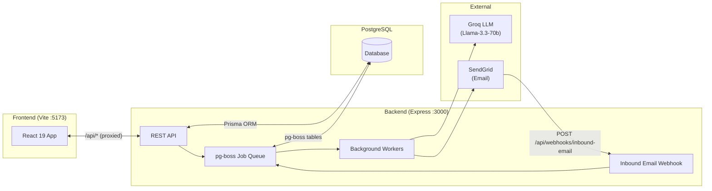
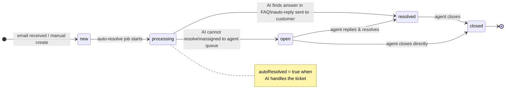
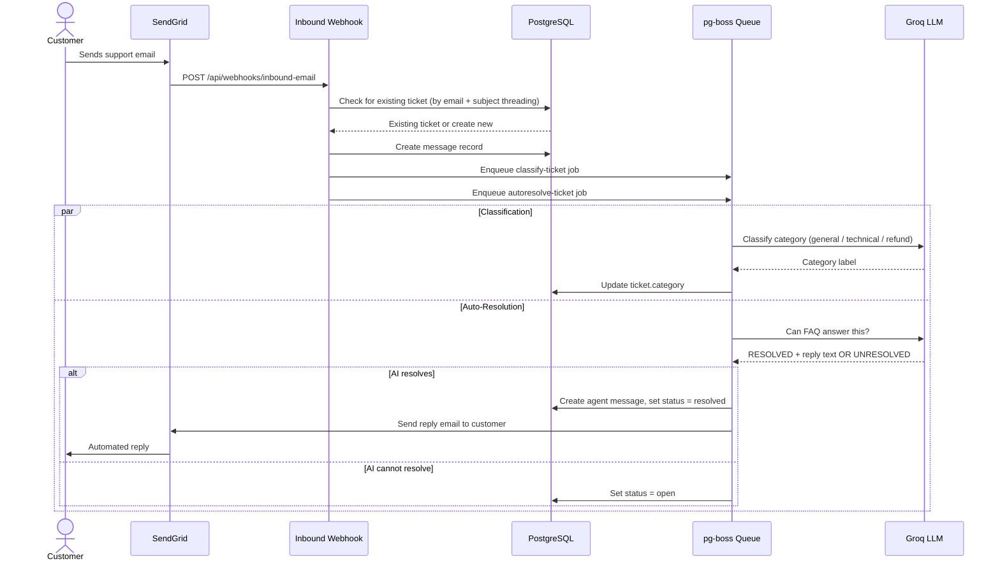
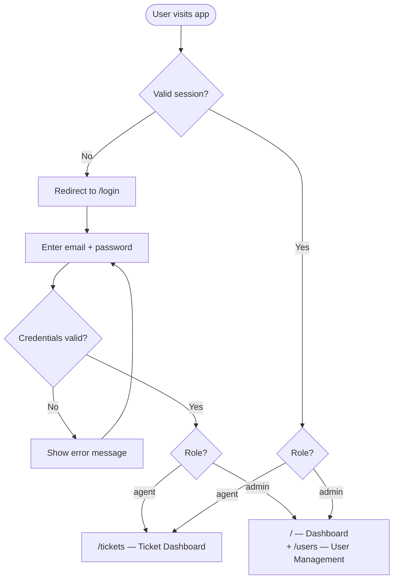
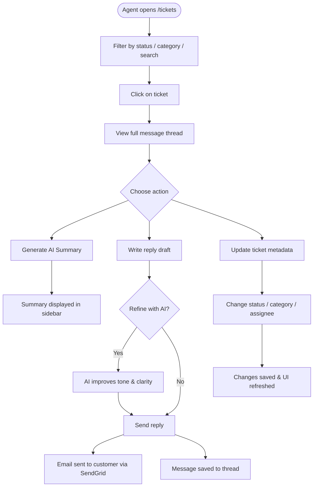

# Helpdesk Claude

An AI-powered ticket management system that turns support emails into classified, auto-resolved tickets — with a human-in-the-loop dashboard for agents to handle what AI can't.

---

## Overview

Support teams receive hundreds of emails daily. Manually reading, classifying, and responding to each ticket is slow and leads to impersonal, canned responses.

This system automatically receives inbound emails, creates tickets, classifies them by category, and attempts to resolve common questions using a knowledge base — all without human intervention. When AI can't resolve a ticket, it routes it to an agent with a full message thread, AI-generated summary, and a suggested reply ready to refine and send.

---

## Features

- **Inbound email → ticket** — SendGrid parses incoming emails and creates tickets via webhook
- **Email threading** — replies to the same subject/customer are grouped into one ticket
- **AI auto-classification** — Groq LLM categorises every new ticket (General / Technical / Refund)
- **AI auto-resolution** — FAQ-based knowledge lookup; if an answer exists, the ticket is resolved and a reply is sent automatically
- **AI ticket summarisation** — agents can generate a 2–4 sentence summary of any conversation
- **AI reply refinement** — agents can improve tone and clarity of their draft replies with one click
- **Outbound email replies** — agent replies are sent to the customer via SendGrid
- **Ticket lifecycle management** — status, category, and assignee updates with audit trail
- **Dashboard** — live stats (total, open, AI-resolved, avg resolution time) + tickets-per-day chart
- **User management** — admin-only CRUD for agent accounts
- **Role-based access** — `admin` (full access) and `agent` (ticket management only)
- **Background job queue** — pg-boss handles classify, auto-resolve, and email-send jobs with retries

---

## Tech Stack

| Layer | Technology |
|---|---|
| Frontend | React 19, TypeScript, React Router v7, Vite |
| Backend | Node.js, Express 5, TypeScript |
| Database | PostgreSQL, Prisma ORM |
| Auth | Better Auth (database sessions, no JWT) |
| AI | Groq Llama-3.3-70b via Vercel AI SDK |
| Email | SendGrid (inbound parsing + outbound sending) |
| Job Queue | pg-boss (PostgreSQL-backed, no Redis needed) |
| UI | Tailwind CSS v4, shadcn/ui, Recharts |
| Testing | Vitest + React Testing Library (unit), Playwright (E2E) |
| Error Tracking | Sentry (client + server) |
| Package Manager | Bun |

---

## Architecture



---

## User Flows

### Ticket Status Lifecycle



---

### Inbound Email & Auto-Resolution



---

### Authentication Flow



---

### Agent Ticket Workflow



---

## Project Structure

```
helpdesk-claude/
├── client/                   # React frontend (Vite, port 5173)
│   └── src/
│       ├── layouts/          # ProtectedLayout, AdminLayout
│       ├── pages/
│       │   ├── tickets/      # TicketsPage, TicketDetailPage, ReplyForm, etc.
│       │   └── users/        # UsersPage, UserForm, UsersTable
│       ├── components/ui/    # shadcn/ui components
│       └── lib/              # auth-client, constants, utils
├── server/                   # Express backend (port 3000)
│   └── src/
│       ├── routes/           # tickets, messages, users, agents, stats
│       ├── webhooks/         # inbound-email.ts
│       ├── jobs/             # classify-ticket, autoresolve-ticket, send-reply-email
│       ├── lib/              # ai.ts, auth.ts, prisma.ts, queue.ts, email.ts
│       └── middleware/       # requireAuth, requireAdmin, rateLimiter, webhookAuth
│   └── prisma/
│       ├── schema.prisma
│       └── migrations/
├── core/                     # Shared Zod schemas & types (@helpdesk/core)
│   └── src/schemas/          # tickets.ts, users.ts, messages.ts, stats.ts
├── e2e/                      # Playwright end-to-end tests
├── playwright.config.ts
└── docker-compose.yml
```

---

## Getting Started

### Prerequisites

- [Bun](https://bun.sh) v1.0+
- PostgreSQL 15+
- A [SendGrid](https://sendgrid.com) account (for email)
- A [Groq](https://console.groq.com) API key (for AI features)

### Install

```bash
git clone https://github.com/your-org/helpdesk-claude.git
cd helpdesk-claude
bun install
```

### Environment Variables

Copy the example and fill in values:

```bash
cp server/src/.env.example server/src/.env
cp .env.test.example .env.test        # for E2E tests only
```

| Variable | Description |
|---|---|
| `DATABASE_URL` | PostgreSQL connection string |
| `BETTER_AUTH_SECRET` | 64-char hex secret for session signing |
| `BETTER_AUTH_URL` | Base URL of the server (e.g. `http://localhost:3000`) |
| `TRUSTED_ORIGINS` | Comma-separated list of allowed client origins |
| `ADMIN_EMAIL` | Email address for the seeded admin user |
| `ADMIN_PASSWORD` | Password for the seeded admin user |
| `GROQ_API_KEY` | Groq API key for LLM features |
| `SENDGRID_API_KEY` | SendGrid API key for outbound email |
| `SENDGRID_FROM_EMAIL` | Sender address (e.g. `support@yourdomain.com`) |
| `SENDGRID_FROM_NAME` | Sender display name |
| `INBOUND_WEBHOOK_TOKEN` | Secret token for the inbound email webhook |
| `SENTRY_DSN` | *(optional)* Server-side Sentry DSN |
| `VITE_SENTRY_DSN` | *(optional)* Client-side Sentry DSN |

### Database Setup

```bash
cd server

# Run migrations
set -a && source src/.env && set +a
bun run node_modules/prisma/build/index.js migrate dev --name init

# Seed admin user + agents
bun run src/seed.ts
```

### Run Dev Servers

```bash
# From the repo root — starts both client and server with hot reload
bun run dev

# Or individually
bun run dev:server    # Express on :3000
bun run dev:client    # Vite on :5173
```

---

## Running Tests

```bash
# Unit tests (Vitest + React Testing Library)
bun run test:unit

# E2E tests — requires .env.test and a running test DB
bun run test:e2e          # headless
bun run test:e2e:ui       # interactive Playwright UI
```

---

## Data Model (abbreviated)

```
User         — id, name, email, role (admin|agent), deletedAt
Ticket       — id, subject, fromEmail, fromName, status, category,
               assignedToId, autoResolved, resolvedAt
Message      — id, ticketId, body, sender (agent|customer), authorId
Session      — Better Auth managed, stored in PostgreSQL
```

**Ticket statuses:** `new` → `processing` → `open` → `resolved` → `closed`

**Ticket categories:** `general_questions` · `technical_questions` · `refund`
